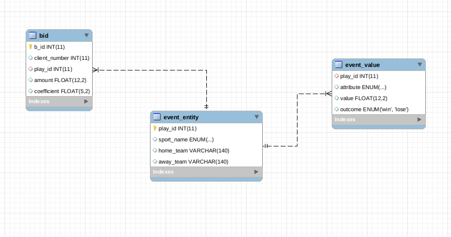
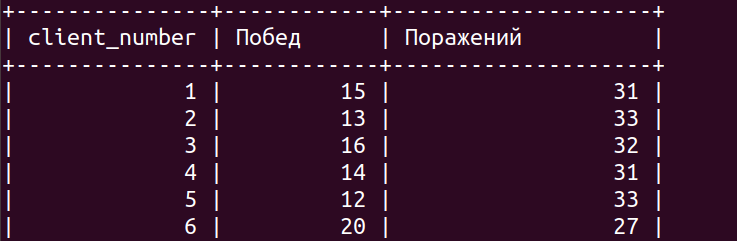
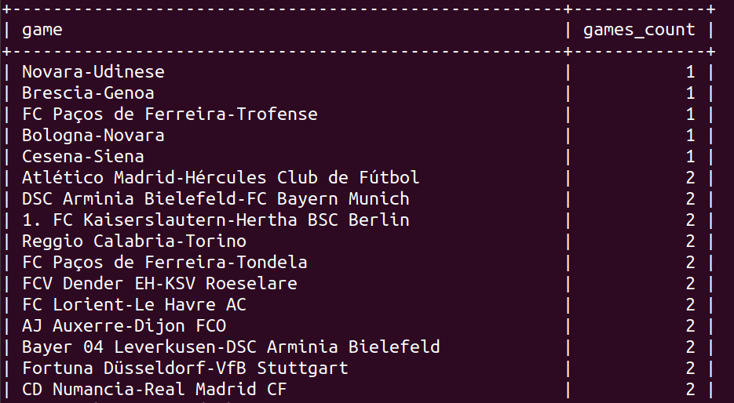

## Тестовое SQL

	

Имеется урезанная БД букмекерской конторы, в которой имеются следующие таблицы:

1) **event_entity**,  в которой имеются  столбцы 
	- `play_id` - идентификатор игры, 
	- `sport_name` - название спорта, 
	- `home_team` и `away_team` - название домашней и выездной команды соответственно;

2) **event_value**, в которой хранятся 
	- `play_id` - идентификатор игры, 
	- `value` - коэффициент на определённый исход, 
	- `attribute` - исход события, 
	- `outcome` - сыграла ставка либо нет;

3) **bid**, в которой имеются столбцы 
	- `b_id` - идентификатор ставки, 
	- `client_number` - идентификатор клиента, 
	- `play_id` - идентификатор игры, 
	- `amount` - сумму, которую поставил клиент, 
	- `coefficient` - коэффициент, на который поставил клиент.

### Задание

1. Необходимо написать запрос, который находит  сколько ставок сыграло и не сыграло у каждого пользователя. Неполный результат запроса представлен на рисунке

2. Необходимо написать запрос, который находит сколько раз между собой играли команды. Важно, если команда А играла против команды В, а затем команда В играла против команды А, то это считается как одно и тоже событие. То есть, результат должен быть следующим: А против В - 2 игры.  Неполный результат запроса представлен на рисунке

СУБД: MySQL
	
Дамп БД находится в [sql/test_task_sql.sql](sql/test_task_sql.sql)

### Выполнение

- [sql/task1.sql](task1.sql) - запрос для задания 1;
- [sql/task2.sql](task2.sql) - запрос для задания 2.